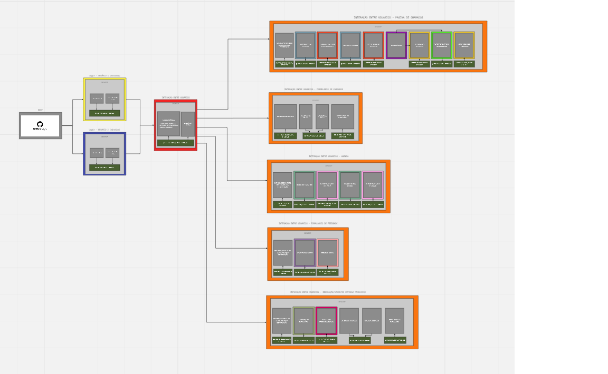
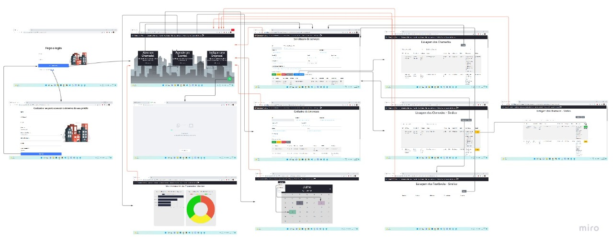

# Informações do Projeto
`TÍTULO DO PROJETO`  

**SIP - Predial Security**

`CURSO` 

**Engenharia de Software**

## Participantes

Os membros do grupo são: 
- Bárbara Mattioly Andrade
- Laura Enísia Rodrigues Melo
- Marco Antônio Miranda Ferreira
- Pedro Henrique Pimenta Ribeiro

# Estrutura do Documento

- [Informações do Projeto](#informações-do-projeto)
  - [Participantes](#participantes)
- [Estrutura do Documento](#estrutura-do-documento)
- [Introdução](#introdução)
  - [Problema](#problema)
  - [Objetivos](#objetivos)
  - [Justificativa](#justificativa)
  - [Público-Alvo](#público-alvo)
- [Especificações do Projeto](#especificações-do-projeto)
  - [Personas e Mapas de Empatia](#personas-e-mapas-de-empatia)
  - [Histórias de Usuários](#histórias-de-usuários)
  - [Requisitos](#requisitos)
    - [Requisitos Funcionais](#requisitos-funcionais)
    - [Requisitos não Funcionais](#requisitos-não-funcionais)
  - [Restrições](#restrições)
- [Projeto de Interface](#projeto-de-interface)
  - [User Flow](#user-flow)
  - [Wireframes](#wireframes)
  - [Divisão de Papéis](#divisão-de-papéis)
  - [Ferramentas](#ferramentas)
  - [Controle de Versão](#controle-de-versão)
- [**############## SPRINT 1 ACABA AQUI #############**](#-sprint-1-acaba-aqui-)
- [Projeto da Solução](#projeto-da-solução)
  - [Tecnologias Utilizadas](#tecnologias-utilizadas)
  - [Arquitetura da solução](#arquitetura-da-solução)
- [Avaliação da Aplicação](#avaliação-da-aplicação)
  - [Plano de Testes](#plano-de-testes)
  - [Ferramentas de Testes (Opcional)](#ferramentas-de-testes-opcional)
  - [Registros de Testes](#registros-de-testes)
- [Referências](#referências)

# Introdução

## Problema

O problema principal é a falta de organização e gestão das demandas preditivas. Os síndicos recebem várias reclamações e queixas de moradores e funcionários de problemas recorrentes no edifício. Com a alta demanda, é inviável administrar e categorizar quais são os problemas atuais, os que já foram solucionados e os que estão em andamento. Além disso, a falta de tempo em gerir todos os incidentes e procurar empresas que solucionam determinados problemas é um fator que insatisfaz o síndico e impacta no tempo de solução das ocorrências.

## Objetivos

 O objetivo desse trabalho é desenvolver uma aplicação Web que permita otimizar e gerenciar os problemas diários que os moradores e funcionários de um prédio/condomínio sofrem. Além disso, possui o intuito de auxiliar o síndico a priorizar demandas de acordo com sua importância e garantir a melhoria contínua e a qualidade das demandas preditivas.

## Justificativa

 O projeto tem como justificativa solucionar os problemas do público-alvo de modo que realize as demandas preditivas de modo ágil e organizado, favorecendo todos os indivíduos.

## Público-Alvo

O público  alvo deste trabalho são os residentes de um prédio ou condomínio: 
- Moradores;
- Síndicos;

# Especificações do Projeto

As personas e potenciais usuárias da solução SIP são os frequentadores de um prédio residencial, dentre eles a síndica, os moradores e o porteiro.
As ferramentar utilizadas para montar as personas e o mapa de empatia foram: O miro, onde foram estruturados todos os dados do processo de design thinking após as entrevistas e o Canva, por onde foi feito o template das personas.

## Personas e Mapas de Empatia

**Personas**

> **Exemplo de Persona**
> Lilian - Síndica
> 

> João Wagner - Morador
> 

> Antonio Carlos - Porteiro
> 

**Mapas de Empatia**
> Lilian - Síndica
> 

> João Wagner - Morador
> 

> Antonio Carlos - Porteiro
> 

## Histórias de Usuários

Com base na análise das personas forma identificadas as seguintes histórias de usuários:

|EU COMO... `PERSONA`| QUERO/PRECISO ... `FUNCIONALIDADE` |PARA ... `MOTIVO/VALOR`                 |
|--------------------|------------------------------------|----------------------------------------|
| **Síndico do prédio**  | Administrar as demandas do condomínio, feitas pelos moradores.          | que possa dar andamento em todos os chamados
| **Síndico do prédio**    | De sugestão de empresas que solucionam problemas das demandas preditivas         | garantir a maior qualidade possível dos chamados |
| **Síndico do prédio**  | preciso registrar todos os eventos e reuniões marcadas pelos inquilinos           | que não haja conflito de eventos nos espaços comuns do prédio  |
| **Síndico do prédio**       | preciso saber o feedback dos moradores acerca dos trabalhos e demandas realizadas no condomínio      | que eu possa saber em qual ponto melhorar |
| **Morador do Prédio**  | saber como está a situação dos problemas do prédio          | para ter visibilidade de como está a solução do meu problema           |

## Requisitos

As tabelas que se seguem apresentam os requisitos funcionais e não funcionais que detalham o escopo do projeto.

### Requisitos Funcionais

|ID    | Descrição do Requisito  | Prioridade |
|------|-----------------------------------------|----|
|RF-01|  O site deverá apresentar na tela inicial um botão com o ícone do Whatsapp que irá linkar diretamente para o contato da empresa SIP. | BAIXA | 
|RF-02|  O site deverá apresentar uma tela com login (e-mail e senha). Caso o usuário não seja cadastrado, é necessário o cadastro da conta. Após o usuário executar seu login, acessa a tela principal.   | ALTA |
|RF-03| Ao preencher o login, existe o acesso para o morador ou síndico. | MÉDIA |
|RF-04| No menu, deve existir a opção Cadastro de Chamado - Solicitação de Serviços, possibilitando o morador/síndico preencher um formulário no qual é inserido o motivo e a categoria do problema do apartamento/condomínio, e também, informado os dados pessoais do solicitante.   | ALTA |
|RF-05| No menu, agendamento de eventos, o morador/síndico pode agendar algum evento no espaço comum do condomínio (ex: salão de festas), e também marcar uma reunião (ex: reunião de moradores).   | ALTA |
|RF-06| No menu, chamados em Abertos, o usuário acompanha/monitora através de gráficos os chamados  | MÉDIA |
|RF-07| No menu, Indicação de Empresas, o usuário, por meio de um formulário, cadastra e indica uma empresa para ser parceira do SIP. Com isso, há a possibilidade da empresa, futuramente, ser contatada e realizar algum serviço que o condomínio necessite. | BAIXA |

### Requisitos não Funcionais

|ID     | Descrição do Requisito  |Prioridade |
|-------|-------------------------|----|
|RNF-01| O site deverá apresentar os grupos de Administrador e Usuário na parte do login (administrador: síndico | usuário: morador), para que apenas as pessoas responsáveis tenham acesso ao visualizar determinadas telas e clicar em determinados botões. | MÉDIA | 
|RNF-02|  O site deve ser publicado em um ambiente acessível publicamente na Internet (Repl.it, GitHub Pages, Heroku)  |  ALTA |
|RNF-03| O site deve ser compatível com os principais navegadores do mercado (Google Chrome, Firefox, Microsoft Edge)  |  ALTA |

## Restrições

O projeto está restrito pelos itens apresentados na tabela a seguir.

|ID| Restrição                                                                                               |
|--|---------------------------------------------------------------------------------------------------------|
|01| O projeto deverá ser entregue no final do semestre letivo, não podendo extrapolar a data de 05/07/2022. |
|02| Não pode ser desenvolvido um módulo de backend, apenas tecnologias básicas da Web no FrontEnd           |
|03| A equipe não pode subcontratar o desenvolvimento do trabalho                                            |
|04| Estar publicado na WEB                         |
|05| Possuir um smartphone ou notebook com internet para poder acessar o software.                         |
|05| Realizar um cadastro no sistema para poder acessar todas as funcionalidades que o programa possui                       |

# Projeto de Interface

Para a montagem de todas as telas do sistema, nossa principal preocupação foi na usabilidade, buscando tornar a interface o mais limpa e intuitiva possível para o usuário.
O protótipo das telas foi feito através do figma.
Link de acesso ao protótipo interativo: https://www.figma.com/file/96nd2RS4AxKHqzXrUbuMJP/Prot%C3%B3tipo-SIP?node-id=0%3A1

## User Flow

> 

## Wireframes

1. **Tela 1 - Inicial**
>  Tela Inicial que apresenta os principais meios de atuação possíveis através do nosso App. São apresentados os botões para as páginas de:
>    - Botão de Login;
>    - Botão de Cadastro;
>    - Título;
>    - Descrição do Sistema;
>    - Perfis cadastrados;
>    - Reclame aqui (Fale conosco);
>    - E-mail de contato.

> 
 
 2. **Tela 2 - Login**
>  Tela de Login apresenta os espaços para inserir o nome de usuário, senha, logo e os botões de Entrar e o de Cadastrar.

> 

3. **Tela 3 - Cadastro**
>  Tela de Cadastro apresenta os espaços de:
>    - Nome completo;
>    - E-mail;
>    - Data de nascimento;
>    - Nome de usuário;
>    - Senha;
>    - Opção de concordância com os termos de uso do SIP;
>    - Botão de cadastro como síndico;
>    - Botão de cadastro como usuário.

> 

3.1. **Tela 3.1 - Síndico**
>  Tela em que se é selecionado o edifício e o código de acesso do síndico do prédio para efetuar o cadastro.

> 

3.2 **Tela 3.2 - Confirmação de Cadastro**
>  Tela onde se é informado a condição do cadastro e é instruída a confirmação da mesma na caixa de entrada do e-mail do usuário e o botão de iniciar

> 

4. **Tela 4 - Principal**
>  Tela onde se encontram o Logo, botões de:
>    - Mapa do prédio;
>    - Como agir em emergências;
>    - Gestão de melhorias;
>    - Direcionamento para o grupo do Whatsapp do prédio;
>    - Avaliações do sistema;
>    - Informações sobre o projeto.

> 

5. **Tela 5 - Mapa Predial**
>  Tela em que se encontram a descrição, localização e instrução das datas de revisão e vistoria dos equipamentos presentes em cada andar, além dos botões de:
>    - Mapa do prédio;
>    - Como agir em emergências;
>    - Gestão de melhorias.

> 

5.1. **Tela 5.1 - Data de Revisão e Lote do Equipamento**
>  Tela em que se é apresentado o nome do equipamento, data última revisão, data da próxima revisão e do lote.

> 

5.2 **Tela 5.2 - Adição de Equipamentos Por Andar**
>  Tela em que se é informado o andar do edifício e quais são os equipamentos de segurança a serem adicionados naquele andar

> 

5.3 **Tela 5.3 - Edição de Equipamentos Por Andar**
>  Tela em que são efetuadas as mudanças dos dados de determinados equipamentos de segurança, assim como extintores e câmeras de segurança.

> 

6. **Tela 6 - Como Agir em Emergências**
>  Tela em que são apresentados botões para os diferentes tipos de emergências possíveis, juntamente com os números de telefone mais úteis para ocasiões especiais.

> 

6.1. **Tela 6.1 - Item Como Agir em Emergências**
>  Tela onde se é apresentado um problema, em que se é fornecido maneiras de ação para atuar em cada problema específico, com conteúdos entregues em forma de vídeo e texto visando instruir o usuário com conhecimento útil para tal ocasião.

> 

7. **Tela 7 - Gestão de Melhorias**
>  Tela onde estão presentes espaços para a sugestão de ideias para melhoria, botão do reclame aqui e o botão para a indicação e sugestão de empresas e startups que estejam dispostas a atuarem junto ao nosso programa e a tecer parcerias e patrocínios juntamente aos edifícios usuários do nosso sistema.

> 

8. **Tela 8 - Sobre a Empresa**
>  Tela onde será impresso todas as informações sobre a nossa empresa, os contribuidores nossas parcerias e patrocínios.

> 

# Metodologia

**Metodologias ágeis**
No trabalho foi utilizado a metodologia SCRUM para desenvolver o projeto. Inicialmente foi realizado o Backlog do produto, em seguida divididas as tarefas realizadas em Sprints, e por fim realizadas incrementos no sistema, com iterações curtas, para melhoria do projeto. O grupo foi dividido com a presença de um Scrum Master, um dono do produto e o time desenvolvedor.
 
 Antes das realizações das Sprints, todo o projeto foi organizado em um quadro Kanban, no Trello, com partes de "a fazer", "fazendo" e "concluído", para o grupo se organizar, estabelecer as metas do projeto e ter em vista todo o processo do sistema. Além disso, durante o processo foi estabelecidas datas de entregas das funcionalidades, para não comprometer o projeto e tarefas de outro integrante.

**Processo: Design Thinking**
No processo de Design Thinking o grupo utilizou a plataforma Miro. Ela auxiliou para melhor selecionar e organizar todas as ideias da equipe. Foram realizadas várias reuniões para discutir e definir os principais requisitos do projeto, tanto os funcionais, quanto os não funcionais.

Inicialmente, fizemos reuniões presenciais para discutirmos as ideias do grupo: quais eram nossas dúvidas, certezas, suposições acerca do nosso problema, e também, quais eram as pessoas envolvidas nele seja fundamental, importante ou influenciadora. A Partir desses dados, foi inserido e registrado tudo no Miro, dentro da Matriz de Alinhamento - CSD e dentro do Mapa de Stakeholders.

Posteriormente, realizamos pesquisas e entrevistas com as pessoas do mapa de Stakeholders para entendermos as dores das pessoas e assim, oferecer soluções com o nosso projeto. Essa etapa de entrevista foi realizada de 2 formas: 
Entrevista realizada de modo presencial: Alguns integrantes do grupo entrevistaram síndicos, moradores e porteiros de prédios. 
Criado um formulário online:  Alguns integrantes do grupo criaram o formulário e divulgaram para grupos de whatsapp afim de obter opiniões acerca da segurança predial.
Os resultados das pesquisas realizadas pelo grupo, juntamente com as personas e os mapas de empatia, foram extremamente importantes pois ofereceram maior direcionamento para criarmos o nosso projeto.

Por fim, foram realizadas 2 reuniões diariamente para a equipe debater, sugerir ou acrescentar algum item acerca das ideias de cada integrante. Foram selecionadas as ideias principais e organizadas de acordo com o custo e o impacto. Em seguida, as principais ideias foram detalhadas no mapa conceitual, especificando como a ideia funciona, por que ela melhora a experiência do cliente, quem irá usar e quando, e como a ideia pode ser implementada. 

Com a finalização da etapa de entendimento e da etapa de exploração do nosso projeto, concluímos o Design Thinking e prosseguimos para a implementação do FrameWork Scrum do nosso projeto.

**Processo: FrameWork Scrum**
No processo de FrameWork Scrum o grupo utilizou a plataforma Figma. Ela auxiliou para criar e desenvolver as wireframes, fazer o protótipo interativo com os botões e também, possibilitou que todos da equipe trabalhassem mutuamente criando e editando as telas do projeto.

Durante esse processo, foram realizadas 2 reuniões diariamente, uma daily matutina para a equipe se conscientizar sobre as tarefas de cada um e qual impacto estava causando no trabalho de outro integrante. Já na reunião vespertina, era conversado sobre as atividades realizadas, qual seria a próxima parte do projeto a ser implementada e separada a tarefa que cada um iria executar.

## Divisão de Papéis

A equipe utiliza metodologias ágeis, tendo escolhido o Scrum como base para definições do processo de desenvolvimento.

A equipe está organizada da seguinte forma: 
- Scrum Master: Bárbara Mattioly
- Product Owner: Laura Enísia
- Equipe de desenvolvimento: 
  - Bárbara
  - Laura
  - Marco
  - Pedro 

Para organização e distribuição das tarefas do projeto, a equipe utilizou o Discord com canais de texto para definir prazos e projetos a serem entregues. 

## Processo
Inicialmente, o projeto contava com 7 participantes e possuía o tema de "SIP - Segurança Predial". Porém, 3 dos integrantes se desvincularam do grupo. Com isso, algumas funcionalidades do sistema, pensadas inicialmente, ficaram comprometidas. Desse modo, o grupo se reuniu e tomou uma decisão sobre o tema e o projeto em questão: ficou decidido mudar o tema para "SIP - Chamados Prediais". Com isso, foram acrescentadas novas funcionalidades no sistema de acordo com o novo projeto.  

Em seguida, durante as etapas da Sprint 2 e 3, foram realizadas as funcionalidades do sistema de modo individual, para que na Sprint 4, o projeto fosse integrado com todos os artefatos. É válido ressaltar que durante a realização das Sprints foram realizadas reuniões semanais no Discord, a fim de averiguar como estava a situação de cada integrante com sua responsabilidade (o que já foi feito, o que irá fazer ou o que estava impedindo de realizar alguma tarefa). E com isso, o projeto foi tomando performance.

Por fim, foi realizada a integração de todas as aplicações do projeto. Durante esse processo, foram exercidas as ações de verificação do sistema com testes de software, com a finalidade de evitar anomalias no sistema, averiguar conformidades e não conformidades com os requisitos, averiguar o desempenho e também, a qualidade do software. Em seguida foi postado todo o projeto no repositório do Git Hub e realizada sua publicação gerando um link na WEB.

## Atribuições
As atribuições do trabalho ocorreram por meio do Visual Studio, editando e integrando todas as funcionalidades do sistema com códigos em HTML, CSS e JavaScript. Também foi utilizado como recurso, os aplicativos Discord e WhatsApp para a realizações de chamadas com o time de desenvolvimento. Durante as reuniões, eram acordadas novas funcionalidades e edições de artefatos do projeto. Por fim, era realizado o upload dos códigos no Git Hub e verificado todas as atribuições do projeto. 

## Ferramentas

**Relação de Ambientes de Trabalho**
Os artefatos do projeto são desenvolvidos a partir de diversas plataformas e a relação dos ambientes com seu respectivo propósito é apresentada na tabela que se segue.

| Ambiente  | Plataforma              |Link de Acesso |
|-----------|-------------------------|---------------|
|Processo de Design Thinking | Miro | https://miro.com/app/board/uXjVOA3Il6Y=/ | 
|Projeto de Interface e  Wireframes | Figma |  https://www.figma.com/file/96nd2RS4AxKHqzXrUbuMJP/Prot%C3%B3tipo-SIP?node-id=0%3A1 | 
|Gerenciamento do Projeto | Discord | https://discord.com/login?redirect_to=%2Fchannels%2F%40me |
|Repositório de código fonte | GitHub | https://github.com/ICEI-PUC-Minas-PPLES-TI/plf-es-2022-1-ti1-7946100-02-grupo-5-sip | 
|Gestão de tarefas | Trello | https://trello.com/b/KXKGzARM/quadro-kanban |

A metodologia adotada pelo grupo referente às ferramentas utilizadas para a realização do projeto foram:

- Discord: (Ferramenta de comunicação / organização) usada para reuniões e divisão das tarefas; 
- Whatsapp:  (Ferramenta de comunicação) usada para todos os integrantes do grupo se comunicarem;
- Miro:  (Ferramenta de Design Thinking) usada  para a realização do Design Thinking;
- Figma:  (Ferramenta de diagramação) usada para a realização do FrameWork Scrum;
- Docs:  (Ferramenta de elaboração de relatório) usada para a realização do relatório técnico do projeto;
- GitHub:  (Plataforma de hospedagem) usada para a realização do repositório do projeto;

	O Discord foi escolhido para reunião e divisão de tarefas pois era um aplicativo que todos da equipe conheciam e com ele é possível criar canais de textos para especificar e organizar as tarefas.

	O Whatsapp foi escolhido para o grupo se comunicar devido ser uma ferramenta útil e simples, e que todos da equipe já conheciam o aplicativo e também já utilizavam.

	O Miro foi escolhido devido a uma sugestão do professor  Rommel para realizarmos o Design Thinking. Ele é bem explicativo e possui a possibilidade de todos os integrantes utilizarem a plataforma mutuamente.

	O Figma foi escolhido devido uma opção do grupo. Tivemos a sugestão da plataforma MarvelApp, porém o grupo não se adaptou e achou os recursos desse sistema muito básico. Com isso, migraram para a plataforma Figma que possui várias opções de implementar o projeto e deixá-lo interativo.

	O Docs foi escolhido pelo grupo para a realização do relatório técnico para que, quando finalizado, fosse repassado para o repositório do GitHub. Ele é uma ótima plataforma para todos do grupo editarem mutuamente. 

## Controle de Versão

A ferramenta de controle de versão adotada no projeto foi o [Git](https://git-scm.com/), sendo que o [Github](https://github.com) foi utilizado para hospedagem do repositório `upstream`.

O projeto segue a seguinte convenção para o nome de branchs:
- `master`: versão estável já testada do software
- `funcionalidade-sendo-desenvolvida`: cada membro criou uma branch para desenvolver e publicar sua funcionalidade

Após o término do desenvolvimento, foi aberto um Pull Request da branch onde estava o desenvolvimento, para a master

# Projeto da Solução

SIP é uma ferramenta que visa organizar e otimizar os problemas cotidianos de um prédio/condomínio para que tanto os moradores e o síndico consigam gerenciar as principais demandas e necessidades destes espaços. O sistema SIP promete a organização das demandas,  análise dos indicadores de performance, padrão de qualidade, agendamento de reuniões e eventos, além da possibilidade de contratar empresas parceiras para a solução das demandas preditivas.

# Estrutura do Documento	

# Tecnologias Utilizadas

As tecnologias utilizadas para resolver o problema e implementar sua solução foram: 

- **Linguagem HTML**:
     Linguagem utilizada para a construção das páginas do site.
- **Linguagem CSS**:
     Linguagem utilizada para estilizar e formatar as páginas do site.
- **Linguagem JavaScript**:
     Linguagem utilizada para implementar itens de modo dinâmico nas páginas do site.
- **Bootstrap**:
	  Framework com componentes de interface que une vários projetos de software, provendo uma funcionalidade. 
- **API**:
	  Recurso utilizado para integrar o sistema         
- **WhatsApp**:
	  Utilizada para integrar o botão o do WhatsApp caso o usuário quisesse entrar em contato com a empresa SIP (donos do projeto)         
- **cdn.jsdelivr**:
	  Utilizada para integrar os gráficos gerados dos chamados           
- **Bibliotecas**:
	  Utilizadas para realizarem alguma função na página web          
 - **JQuery**:
	  Utilizado para gerenciar os eventos, as animações e as interações Ajax.          
 - **Chart**:
 	  Para gerar gráficos integrados do total de demandas registradas no chamado, de acordo com o total de chamados separados por categoria
 - **AJAX**:
	  Combinação de várias tecnologias para permitir aplicações interativas 
 - **JSON**:
	  Utilizado para a troca de dados pela Web. 
 - **LocalStorage**:
 	  Utilizado para a troca de dados pela Web. Ele oferece um armazenamento permanente de dados e que podem ser acessados a partir de qualquer janela do site.
 - **Font Awesome**:
	  Utilizado alguns ícones que foram personalizadas no CSS.
	

## Arquitetura da solução
Para resolver o problema e implementar a solução, o grupo adotou as seguintes linguagens: HTML, CSS e JavaScript. Além disso, foi publicado um repositório no Github e por fim o site foi publicado na internet.

**Diagrama de Arquitetura**
> Diagrama de arquitetura com a interação entre os sistemas
> 

Toda a funcionalidade do software é realizada por meio do LocalStorage e todos os dados ficam salvos nele. O fluxo do usuário é feito a partir do login no sistema e em seguida, realizada qual função que deseja (cadastrar um chamado, marcar um evento/reunião ou enviar um feedback). Cada funcionalidade possui restrições que devem ser seguidas para serem validadas. 

**UserFlow**
A seguir imagem indicando todo o userFlow do sistema com a conexão e navegação entre as páginas
> 

# Avaliação da Aplicação

Após o desenvolvimento do software, é necessário e fundamental a realização de testes de usabilidade. Diante disso, segue abaixo alguns cenários de testes deste sistema.

## Plano de Testes

 Para a execução dos testes, foi permitido que um sindico e um morador de 2 condomínios/prédios , acessassem o software para o conhecimento como também para descrever os pontos fortes e fracos dos sistema.

- **Teste 1:** Um dos cenários desenvolvidos neste sistema é a possibilidade de entrar na tela principal sem estar logado. O resultado esperado: exibição de uma tela informando " Você deve estar logado no sistema"
- **Teste 2:** No menu , avalie do sistema, o formulário  Feedback do Condomínio deve ser preenchido completamente, caso contrário o botão confirmar não fica habilitado
- **Teste 3:** O usuário síndico,no Cadastro de Chamados, tem a permissão para acessar e visualizar as chamadas através do botão Espaço Síndico
- **Teste 4:** O usuário morador, no Cadastro de Chamados,tem permissão para o preenchimentos da solicitação de serviços
- **Teste 5:** No Agendamento de Eventos, qualquer usuário pode através do botão Criar registrar e agendar  a data de um possível evento no prédio/condomínio.
- **Teste 6:** Em indicação de empresas, qualquer usuário pode preencher o formulário e  acionar todos os botões dispostos na tela
- **Teste 7:** Na tela inicial , após o acesso do usuário, na parte inferior esquerda da tela, pode-se acionar o Whatsapp do condomínio/prédio , através do ícone deste software.

## Registros de Testes

Em todos os testes descritos anteriormente, verificou-se o satisfatório funcionamento do sistema.
Entretanto, verificou-se pontos que podem ser melhorados.
Em uma próxima versão do sistema, pode-se:
-  Criar uma funcionalidade onde o síndico visualiza, por andar, todos os equipamentos de segurança.
-  Também pode-se, por questão de segurança, anexar uma planta ou animação do prédio.
-  Adicionar grupos de permissão para usuário no sistema, síndico terá as permissões de administrador e morador de usuário do sistema
Pontos fracos:A responsividade da Tela de cadastro deve ser melhorado.

# Referências

- [Trello](https://trello.com/b/KXKGzARM/quadro-kanban)
- [Miro]( https://miro.com/app/board/uXjVOA3Il6Y=/)
- [Overleaf](https://www.overleaf.com/project/62c35ab2ef5f5e5bf09aa363)
- [GitHub](https://github.com/ICEI-PUC-Minas-PPLES-TI/plf-es-2022-1-ti1-7946100-02-grupo-5-sip/blob/master/docs/relatorio/Relatorio)
